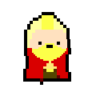
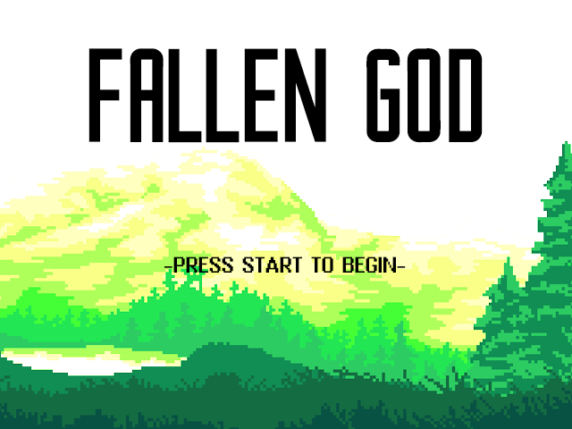
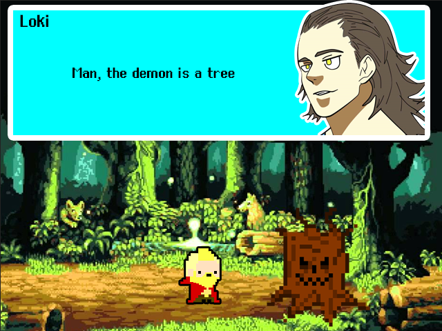
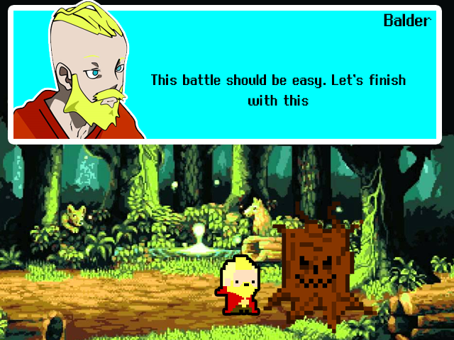
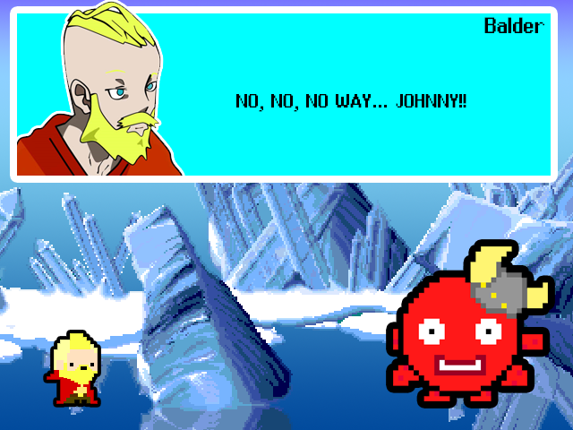
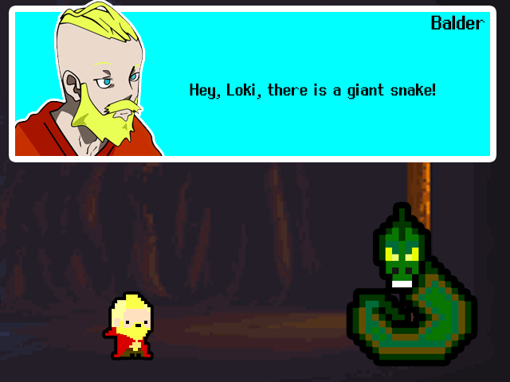
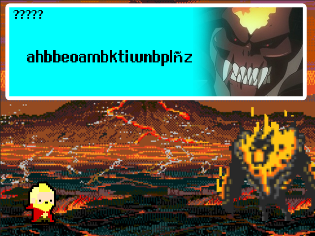

<!-- Improved compatibility of back to top link: See: https://github.com/othneildrew/Best-README-Template/pull/73 -->

<!--
*** Thanks for checking out the Best-README-Template. If you have a suggestion
*** that would make this better, please fork the repo and create a pull request
*** or simply open an issue with the tag "enhancement".
*** Don't forget to give the project a star!
*** Thanks again! Now go create something AMAZING! :D
-->

<!-- PROJECT SHIELDS -->
<!--
*** I'm using markdown "reference style" links for readability.
*** Reference links are enclosed in brackets [ ] instead of parentheses ( ).
*** See the bottom of this document for the declaration of the reference variables
*** for contributors-url, forks-url, etc. This is an optional, concise syntax you may use.
*** https://www.markdownguide.org/basic-syntax/#reference-style-links
-->
[![Contributors][contributors-shield]][contributors-url]
[![Forks][forks-shield]][forks-url]
[![Stargazers][stars-shield]][stars-url]
[![Issues][issues-shield]][issues-url]
[![MIT License][license-shield]][license-url]

<!-- PROJECT LOGO -->
 

  

  <h3 align="center">Falled God</h3>

  

     University project game made in 2019 by <a href="https://github.com/UN41">Unai Orive Mugika</a>, <a href="https://github.com/Danielluengo15">Daniel Luengo Echeverria</a>, <a href="https://github.com/AitorAstorga">Aitor Astorga Saez de Vicuña</a> and <a href="https://github.com/">Danel Mazkiaran Hernandez</a>
     
    <a href="https://github.com/UN41/FALLEN_GOD"><strong>Explore the docs »</strong></a>
     
     
    <a href="https://github.com/UN41/FALLEN_GOD">View Demo</a>
    ·
    <a href="https://github.com/UN41/FALLEN_GOD/issues">Report Bug</a>
    ·
    <a href="https://github.com/UN41/FALLEN_GOD/issues">Request Feature</a>
  

<!-- TABLE OF CONTENTS -->

  
Table of Contents

  <ol>
    <li>
      <a href="#about-the-project">About The Project</a>
      <ul>
        <li><a href="#built-with">Built With</a></li>
      </ul>
    </li>
    <li>
      <a href="#getting-started">Getting Started</a>
      <ul>
        <li><a href="#prerequisites">Prerequisites</a></li>
        <li><a href="#installation">Installation</a></li>
      </ul>
    </li>
    <li><a href="#contributing">Contributing</a></li>
    <li><a href="#license">License</a></li>
    <li><a href="#contact">Contact</a></li>
    <li><a href="#acknowledgments">Acknowledgments</a></li>
  </ol>

<!-- ABOUT THE PROJECT -->
## About The Project

This game was developed as a university game project in 2019, in the first semester of the Graduate in Computer Engineering in Mondragon Unibertsitatea. The code is written in basque but the GUI is in english.

  

For a presentation (in basque) about the game: <a href="https://docs.google.com/presentation/d/1c0PM4SX732tn3AuZbe6d2wMaMBtvkCX3diTZuFrCeew/edit?usp=sharing"><strong>Click here! »</strong></a>

  
Game screenshots

    
    
    
    
    

(<a href="#readme-top">back to top</a>)

### Built With

The thing is built with:

* 
* 
* 

yep, that's it :blush:

(<a href="#readme-top">back to top</a>)

<!-- GETTING STARTED -->
## Getting Started
### Prerequisites

You must have a Windows operating system to play this game. Unfortunately, we were too young and Linux-less when we did this, and we didn't know any better. 

### Installation

To get a local copy up and running follow these simple example steps.

1. Download and unzip the file _[Fallen God.zip](https://github.com/UN41/FALLEN_GOD/releases/tag/1.0.0)_
2. Place the newly created folder in any location you wish
3. Execute _Fallen God.exe_
* OPTIONAL: you can create a shortcut to your Desktop for easy access to the game!

4. Play!

(<a href="#readme-top">back to top</a>)

<!-- CONTRIBUTING -->
## Contributing

Contributions are what make the open source community such an amazing place to learn, inspire, and create. Any contributions you make are **greatly appreciated**.

If you have a suggestion that would make this better, please fork the repo and create a pull request. You can also simply open an issue with the tag "enhancement".
Don't forget to give the project a star! Thanks again!

1. Fork the Project
2. Create your Feature Branch (`git checkout -b feature/AmazingFeature`)
3. Commit your Changes (`git commit -m 'Add some AmazingFeature'`)
4. Push to the Branch (`git push origin feature/AmazingFeature`)
5. Open a Pull Request

(<a href="#readme-top">back to top</a>)

<!-- LICENSE -->
## License

Distributed under the GNU General Public License v3.0. See `LICENSE` for more information.

(<a href="#readme-top">back to top</a>)

<!-- CONTACT -->
## Contact

Daniel Luengo Echeverria - danielluengoecheverria@gmail.com
* [![LinkedIn][linkedin-shield]][linkedin-url-daniel]

Aitor Astorga Saez de Vicuña - a.astorga.sdv@gmail.com
* [![LinkedIn][linkedin-shield]][linkedin-url-aitor]

Project Link: [https://github.com/UN41/FALLEN_GOD](https://github.com/UN41/FALLEN_GOD)

(<a href="#readme-top">back to top</a>)

<!-- ACKNOWLEDGMENTS -->
## Acknowledgments

* [Best-README-Template](https://github.com/othneildrew/Best-README-Template)
* [Choose an Open Source License](https://choosealicense.com)
* [GitHub Emoji Cheat Sheet](https://www.webpagefx.com/tools/emoji-cheat-sheet)
* [Img Shields](https://shields.io)
* [markdown-badges](https://github.com/Ileriayo/markdown-badges#table-of-contents)
* [GitHub Pages](https://pages.github.com)

(<a href="#readme-top">back to top</a>)

<!-- MARKDOWN LINKS & IMAGES -->
<!-- https://www.markdownguide.org/basic-syntax/#reference-style-links -->
[contributors-shield]: https://img.shields.io/github/contributors/UN41/FALLEN_GOD.svg?style=for-the-badge
[contributors-url]: https://github.com/UN41/FALLEN_GOD/graphs/contributors
[forks-shield]: https://img.shields.io/github/forks/UN41/FALLEN_GOD.svg?style=for-the-badge
[forks-url]: https://github.com/UN41/FALLEN_GOD/network/members
[stars-shield]: https://img.shields.io/github/stars/UN41/FALLEN_GOD.svg?style=for-the-badge
[stars-url]: https://github.com/UN41/FALLEN_GOD/stargazers
[issues-shield]: https://img.shields.io/github/issues/UN41/FALLEN_GOD.svg?style=for-the-badge
[issues-url]: https://github.com/UN41/FALLEN_GOD/issues
[license-shield]: https://img.shields.io/github/license/UN41/FALLEN_GOD.svg?style=for-the-badge
[license-url]: https://github.com/UN41/FALLEN_GOD/blob/master/LICENSE
[linkedin-shield]: https://img.shields.io/badge/-LinkedIn-black.svg?style=for-the-badge&logo=linkedin&colorB=555
[linkedin-url-aitor]: https://linkedin.com/in/aitor-astorga-saez-de-vicuña
[linkedin-url-daniel]: https://linkedin.com/in/daniel-luengo-echeverria-05b279224
